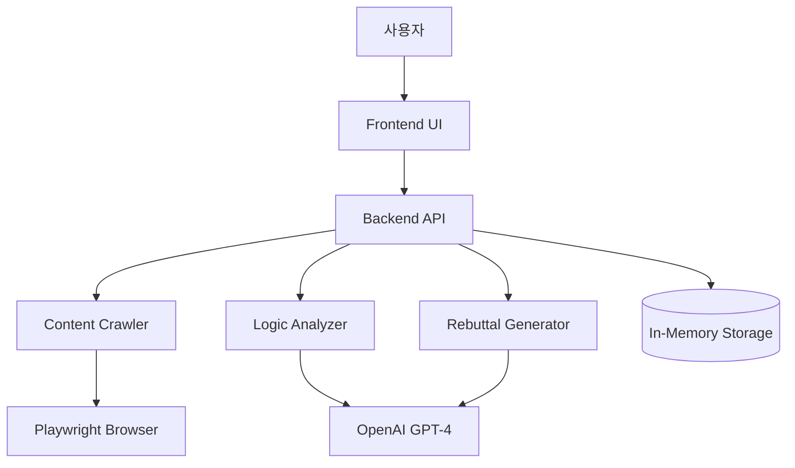

# 반박이 (BanBak-i)

## 프로젝트 개요

**반박이**는 온라인 콘텐츠(기사, 블로그, SNS 게시글)에서 정보의 편향이 심화되는 현상을 문제의식으로 삼아 시작한 프로젝트입니다. 본 서비스는 이러한 콘텐츠의 논리적 구조를 분석하고, 자동으로 논리적 오류와 편향을 감지하여 팩트 기반 반박문을 생성하는 AI 웹 애플리케이션입니다.

URL만 입력하면 콘텐츠를 자동으로 크롤링하고, 주장(Claim), 근거(Evidence), 추론(Inference)으로 체계적으로 구조화하여 논리적 약점과 편향성을 파악할 수 있습니다. 사용자는 원하는 스타일(논리 중심, 팩트 중심, 감정적 균형형)로 반박문을 손쉽게 생성할 수 있습니다.

## 주요 기능

### 1. 콘텐츠 자동 크롤링
- **Playwright 기반 크롤링**: JavaScript로 렌더링되는 동적 콘텐츠도 정확하게 추출
- **본문 추출 알고리즘**: Readability.js를 활용하여 광고, 네비게이션, 푸터 등 불필요한 요소 자동 제거
- **메타데이터 추출**: 제목, 저자, 발행일 등 메타정보 자동 수집
- **다양한 플랫폼 지원**: 뉴스 기사, 블로그, SNS 게시글 등 다양한 형식 지원

### 2. 논리적 구조 분석
- **AI 기반 구조화**: OpenAI GPT-4를 활용하여 텍스트를 주장(Claim), 근거(Evidence), 추론(Inference)으로 자동 분리
- **주장 중요도 평가**: 주요 주장을 중요도 순으로 정렬하여 핵심 논점 파악
- **구조화된 시각화**: 논증 구조를 직관적으로 이해할 수 있는 형태로 제공

### 3. 논리적 오류 감지
자동으로 감지하는 8가지 논리적 오류:
- **Ad Hominem (인신공격)**: 논점을 벗어나 사람을 공격하는 오류
- **Straw Man (허수아비 논법)**: 상대 주장을 왜곡하여 반박하는 오류
- **Hasty Generalization (성급한 일반화)**: 불충분한 사례로 일반화하는 오류
- **False Cause (잘못된 인과관계)**: 인과관계를 잘못 설정하는 오류
- **Appeal to Authority (권위에의 호소)**: 권위에만 의존하는 오류
- **False Dilemma (흑백논리)**: 두 가지 선택지만 있다고 주장하는 오류
- **Slippery Slope (미끄러운 경사면)**: 극단적 결과를 예측하는 오류
- **Circular Reasoning (순환논증)**: 결론을 전제로 사용하는 오류

각 오류에 대해 위치, 심각도, 설명을 함께 제공합니다.

### 4. 다양한 스타일의 반박문 생성

#### 논리 중심 (Logical)
- 논리적 오류 지적에 집중
- 형식적 논리 용어 사용
- 추론 과정의 문제점 강조
- 적합한 상황: 학술적 토론, 논리학 교육

#### 팩트 중심 (Factual)
- 통계와 데이터 인용
- 신뢰할 수 있는 출처 강조
- 객관적이고 중립적인 톤
- 적합한 상황: 사실 검증, 뉴스 반박

#### 감정적 균형형 (Balanced)
- 부드럽고 설득적인 언어
- 상대방 입장 인정 후 반박
- 건설적인 대안 제시
- 적합한 상황: 일상적 대화, SNS 토론

### 5. 분석 결과 요약
- **주요 주장 3개 선별**: 가장 중요한 논점에 집중
- **신뢰도 점수**: 0-100 범위로 각 반박의 신뢰도 표시
- **근거 수준 평가**: 강함(Strong), 보통(Moderate), 약함(Weak)으로 분류
- **시각적 구조화**: 분석 결과를 직관적으로 이해할 수 있는 형태로 제공

## 기술 스택

### Frontend
- **React + TypeScript**: 타입 안전성을 갖춘 모던 웹 개발
- **Tailwind CSS**: 빠른 UI 개발을 위한 유틸리티 CSS 프레임워크
- **React Query**: 효율적인 상태 관리 및 데이터 페칭
- **Axios**: HTTP 클라이언트

### Backend
- **Node.js + Express**: 빠르고 가볍운 웹 서버
- **TypeScript**: 백엔드 코드의 타입 안전성 보장
- **OpenAI GPT-4 API**: 텍스트 분석 및 반박문 생성
- **Playwright**: 동적 웹 페이지 크롤링

### Storage
- **In-Memory Storage**: MVP 단계에서 빠른 개발을 위한 메모리 기반 저장소
- **Future**: PostgreSQL 또는 MongoDB로 마이그레이션 예정

## 시스템 아키텍처



### 주요 컴포넌트

#### 1. Content Crawler
- URL에서 본문 텍스트 추출
- JavaScript 렌더링 지원
- 메타데이터 추출
- 광고 및 불필요한 요소 제거

#### 2. Logic Analyzer
- 텍스트 구조화 (Claim, Evidence, Inference)
- 논리적 오류 감지
- 주장 중요도 평가

#### 3. Rebuttal Generator
- 분석 결과 기반 반박문 생성
- 스타일별 톤 조정
- 출처 및 근거 포함

## API 엔드포인트

```typescript
// 분석 요청
POST /api/analyze
Body: { url: string, rebuttalStyle: 'logical' | 'factual' | 'balanced' }
Response: { analysisId: string, status: string }

// 분석 결과 조회
GET /api/analyze/:id
Response: AnalysisResult

// 분석 진행 상태 확인
GET /api/analyze/:id/status
Response: { status: 'pending' | 'processing' | 'completed' | 'failed', progress: number }

// 반박문 재생성
POST /api/rebuttal/regenerate
Body: { analysisId: string, style: string }
Response: { rebuttal: Rebuttal }
```

## 데이터 모델

### AnalysisResult
```typescript
interface AnalysisResult {
  id: string;
  url: string;
  content: ContentAnalysis;
  logicalFallacies: LogicalFallacy[];
  rebuttal: Rebuttal;
  summary: Summary;
  createdAt: Date;
}
```

### ContentAnalysis
```typescript
interface ContentAnalysis {
  title: string;
  claims: Claim[];
  structure: ArgumentStructure;
}

interface Claim {
  id: string;
  text: string;
  importance: number;
  evidence: Evidence[];
  inferences: Inference[];
}
```

### LogicalFallacy
```typescript
interface LogicalFallacy {
  type: FallacyType;
  description: string;
  location: string;
  severity: 'high' | 'medium' | 'low';
  explanation: string;
}
```

### Rebuttal
```typescript
interface Rebuttal {
  style: RebuttalStyle;
  introduction: string;
  mainPoints: RebuttalPoint[];
  conclusion: string;
  fullText: string;
}
```

## 에러 처리

### URL 접근 오류
- 유효하지 않은 URL 형식 → 400 Bad Request
- URL 접근 불가 → 404 Not Found (재시도 제안)
- 타임아웃 → 408 Request Timeout (재시도 옵션)

### AI 서비스 오류
- API 속도 제한 → 요청 큐잉 및 재시도
- API 타임아웃 → 지수 백오프 재시도 (최대 3회)
- 토큰 제한 초과 → 콘텐츠 청킹 및 분할 처리

## 보안 고려사항

- **입력 검증**: 모든 URL 검증 및 sanitize
- **속도 제한**: 사용자/IP당 API 호출 제한
- **API 키 보안**: 환경 변수로 안전한 관리
- **데이터 프라이버시**: 민감 정보 저장 금지

## 성능 최적화

- **메모리 관리**: 최대 100개 최근 분석 결과 저장
- **비동기 처리**: 장시간 실행 작업 큐잉
- **비용 최적화**: LLM 요청 배치 처리

## 향후 개선 계획

### 1. 양측 의견 보기
- 찬성/반대 양측 논거 자동 생성
- 균형잡힌 시각 제공

### 2. 정치적 편향 탐지
- 좌/우 성향 자동 분석
- 편향 점수 시각화
- 중립적 대안 제시

### 3. 논리 신뢰도 점수 시각화
- 인터랙티브 차트
- 주장별 강도 비교
- 시간에 따른 변화 추적

### 4. 다국어 지원
- 영어, 한국어 외 추가 언어
- 언어별 논리 패턴 학습

### 5. 브라우저 확장 프로그램
- 원클릭 분석
- 인라인 결과 표시
- 소셜 미디어 통합

### 6. 데이터베이스 마이그레이션
- PostgreSQL 또는 MongoDB 연동
- 분석 이력 영구 저장
- 사용자 계정 시스템

## 테스트 전략

### Unit Testing
- 각 컴포넌트 독립적 테스트
- 외부 의존성 모킹
- 80%+ 코드 커버리지 목표

### Integration Testing
- 컴포넌트 간 상호작용 테스트
- 데이터 흐름 검증
- API 엔드포인트 응답 확인

### End-to-End Testing
- 완전한 사용자 워크플로우 테스트
- 실제 URL 사용 테스트
- UI 상호작용 및 결과 표시 검증

## 배포 아키텍처

- **Frontend**: Vercel 또는 Netlify
- **Backend**: AWS ECS, Google Cloud Run, 또는 Heroku
- **Monitoring**: 콘솔/파일 로깅

## 프로젝트 목표

1. **정보의 질 향상**: 온라인 콘텐츠의 논리적 건전성 검증
2. **비판적 사고 증진**: 사용자가 논리적 오류를 인식하도록 돕기
3. **효율적인 반론 작성**: 시간 절약과 품질 향상
4. **교육적 가치**: 논리학 학습 도구로 활용

## 라이선스

MIT License

## 기여하기

이슈 등록, Pull Request, 피드백을 환영합니다!

## 연락처

프로젝트에 대한 문의사항은 GitHub Issues를 통해 남겨주세요.

