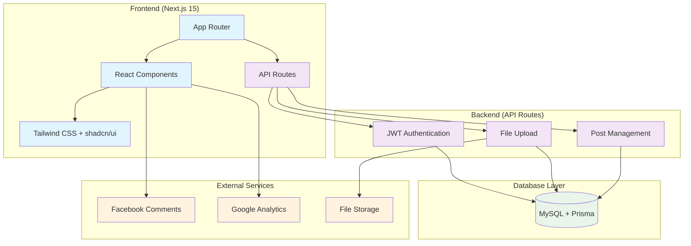

# 다미파파 블로그

## 프로젝트 소개

Next.js 15와 TypeScript로 구축한 개인 블로그 플랫폼입니다. 현대적인 웹 기술을 활용하여 빠르고 효율적인 블로그 환경을 제공합니다.

## 만든 배경

개인적인 기술 블로그를 운영하고 싶었지만, 기존 블로그 플랫폼들의 제약사항들이 아쉬웠습니다:

- **커스터마이징 한계**: 원하는 디자인과 기능을 자유롭게 구현하기 어려움
- **성능 문제**: 로딩 속도가 느리고 최적화가 부족
- **개발자 친화적이지 않음**: 코드 하이라이팅, 마크다운 지원 부족
- **데이터 소유권**: 플랫폼에 종속되는 문제

그래서 직접 풀스택으로 블로그를 개발하기로 결정했습니다.

## 주요 기능

### 📝 콘텐츠 관리
- **마크다운 에디터**: TipTap 기반 WYSIWYG 에디터
- **실시간 미리보기**: 작성하면서 바로 결과 확인
- **이미지 최적화**: 클라이언트 사이드 압축 (90% 용량 감소)
- **태그 시스템**: 자동완성 지원 태그 관리

### 🎨 사용자 경험
- **반응형 디자인**: 모든 디바이스에서 최적화
- **다크/라이트 테마**: 사용자 선호에 따른 테마 변경
- **빠른 로딩**: 이미지 압축 및 최적화로 빠른 페이지 로딩
- **SEO 최적화**: 동적 메타데이터 생성

### 💬 소셜 기능
- **Facebook 댓글**: 소셜 댓글 시스템
- **조회수 추적**: IP 기반 유니크 조회수
- **소셜 공유**: Open Graph 최적화

### 🔐 관리 시스템
- **JWT 인증**: 안전한 토큰 기반 인증
- **관리자 대시보드**: 포스트 및 통계 관리
- **권한 관리**: 역할 기반 접근 제어

## 기술 아키텍처

## 성능 최적화

### 이미지 최적화
- **클라이언트 압축**: 업로드 전 자동 압축 (WebP 변환)
- **Progressive Loading**: 스켈레톤 UI와 지연 로딩
- **캐싱 전략**: 1년 immutable 캐시 헤더

### 코드 최적화
- **Tree Shaking**: 불필요한 코드 제거
- **Bundle 분할**: 페이지별 코드 분할
- **SSR/SSG**: 적절한 렌더링 전략

## 기술적 도전과 해결

### 1. 이미지 업로드 최적화
**문제**: 큰 이미지 파일로 인한 서버 부하와 느린 로딩
**해결**: 클라이언트 사이드 압축으로 90% 파일 크기 감소

### 2. HTML Validation 오류
**문제**: ReactMarkdown에서 `
` 태그 안에 `
` 중첩
**해결**: 이미지가 포함된 paragraph를 div로 렌더링하도록 변경

### 3. 모바일 반응형
**문제**: 프로필 페이지의 텍스트 오버플로우
**해결**: breakpoint별 텍스트 크기와 레이아웃 최적화

## 향후 개선 계획

- [ ] **다국어 지원**: i18n 시스템 구축
- [ ] **검색 최적화**: 전문 검색 엔진 도입
- [ ] **PWA 지원**: 오프라인 읽기 기능
- [ ] **댓글 알림**: 실시간 알림 시스템
- [ ] **분석 대시보드**: 상세한 방문 통계

## 배포 및 운영

현재 EC2 t3.micro 인스턴스에서 운영 중이며, Docker Compose를 사용한 컨테이너화된 배포를 통해 안정성을 확보했습니다.

